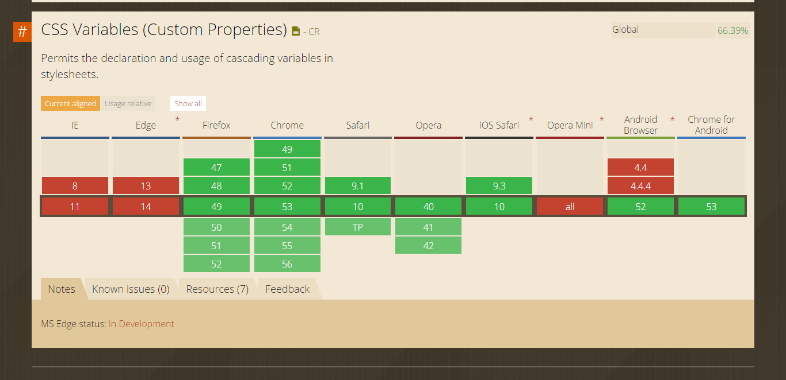

---

layout: ribbon

style: |
    .slide:after {
        display: none;
    }
    #Cover {
       background: url(pictures/back-to-the-future.jpg) no-repeat center;
       background-size: cover;
    }
    #Cover h2 {
        display: none;
    }
    #Cover>div {
       display: flex;
       flex-direction: column;
       justify-content: flex-end;
    }
    #Cover p {
        margin-bottom: 10vh;
        text-align:center;
        color:#FFF;
        font-style:italic;
        font-size:20px;
        }
        #Cover p a {
            color:#FFF;
            }
     .slide.small pre code {
         line-height: 30px;
     }
     #Grid .wrapper {
          display: grid;
          grid-template-columns: 1fr 1fr 2fr 2fr 100px;
          grid-gap: 10px;
     }
     #Grid .box {
          background-color: #444;
          color: #fff;
          border-radius: 5px;
          padding: 20px;
          font-size: 150%;
        }

        #Grid .box:nth-child(even) {
          background-color: #ccc;
          color: #000;
        }

        #Grid .box2 {
          grid-column: 3 / span 2;
          grid-row: 2 / span 2;
          outline: 2px solid red;
          z-index: 10;
        }
---

# Back to the CSS future {#Cover}

*Human Talks Nantes, par [@jutanguy](http://twitter.com/jutanguy)*

## **CSS**

## **Past**

## 
{:.cover .h }

## **Present**

## 
{:.cover .h }

## 
{:.cover .h}

## **CSS versions**

## Monolithic versioning

- CSS v1
- CSS v2
- CSS v2.1

## CSS Modules

- CSS Selector Module Level 3
- CSS Values and Units Module Level 3
- CSS Shapes Module Level 1
- CSS Flexible Box Layout Module Level 1
- CSS Grid Layout Module Level 1

## **Units**

## Units

- Absoulute: px, cm, mm, pt in
- Font-relative: em, rem, ex, ch
- Viewport-relative: vw, vh, vmin, vmax
- Layout: fr

## 
{:.cover .w}

## **Feature queries**

## 
{:.cover .w}

## First-letter

~~~css
p::first-letter {
 initial-letter: 4;
 color: #FE742F;
 font-weight: bold;
 margin-right: 0.5em;
}
~~~

## 
{:.cover .w}

## Features queries

~~~css
@supports (initial-letter: 4) {
  p::first-letter {
     initial-letter: 4;
     color: #FE742F;
     font-weight: bold;
     margin-right: 0.5em;
  }
}
~~~

## 
{:.cover .w}

## 
{:.cover .w}

## **Flexbox**

## Flexbox basics

~~~css
.vertical-center {
    display: flex;
    align-items: center;
}
.equal-height-cols-container {
    display: flex;
    align-items: stretch;
}
~~~

## Fluid layout
{:.small}

~~~css
.container {
    display: flex;
    align-items: stretch;
}
.container > aside {
    flex: 1 0 300px;
}
.container > section {
    flex: 2 1 auto;
}
~~~

## 
{:.cover .w}

## 
{:.cover .w}

## **Future**

## **Variables**

## Variables

~~~css
:root {
  --main-bg-color: blue;
}

body {
  background-color: var(--main-bg-color);
}
~~~

## I can haz vars already !

### Sass
~~~scss
$sass-primary-color: #fff;
~~~

### Less
~~~less
@less-primary-color: #beeeef;
~~~

## 
{:.cover .w}

## 
{:.cover .w}

## **Shapes**

## 
{:.cover .w}

## 
{:.cover .w}

## Grid {#Grid}

  
1

  
2

  
3

  
4

  
5

  
6

  
7

  
8

  
9

  
10

  
11

  
12

## Grid css
{:.small}

~~~css
.wrapper {
  display: grid;
  grid-template-columns: 1fr 1fr 2fr 2fr 100px;
  grid-gap: 10px;
}
.box {
    /* basic styles */
}
.box2 {
    grid-column: 3 / span 2;
    grid-row: 2 / span 2;
}
~~~

## 
{:.cover .w}

## 
{:.cover .w}

## **Vendor prefixes**

## Prefix galore
{:.small}

~~~css
/* Theory */
background: -webkit-linear-gradient(#fff, #000);
background: -moz-linear-gradient(#fff, #000);
background: -ms-linear-gradient(#fff, #000);
background: -o-linear-gradient(#fff, #000);
background: linear-gradient(#fff, #000);

/* Practice */
background: -webkit-linear-gradient(#fff, #000);
~~~

## **Autoprefixers**

## **-webkit-border-radius on firefox and ie**

## WIP prefixes & syntax
{:.small}

~~~css
.version-2009 {
    display: -webkit-box;
    -webkit-box-orient: vertical;
}
.version-2012 {
    display: flexbox;
}
.current {
    display: flex;
}
~~~

## **Feature flags**

## Links

- <http://labs.jensimmons.com>
- <https://rachelandrew.co.uk>
- <https://css-tricks.com/snippets/css/a-guide-to-flexbox/>
- <http://flexboxfroggy.com/>
- <http://www.flexboxdefense.com/>
- <https://css-tricks.com/snippets/css/complete-guide-grid/>
- <http://gridbyexample.com>
